# Portfólio - Rogério Caetano

Um portfólio pessoal moderno e responsivo, desenvolvido para apresentar meus projetos e habilidades como desenvolvedor front-end e mobile.

🔗 **[Visite o site publicado](https://rogeriocaetanojr.github.io/portfolio-rogerio/)**

## Preview

### Desktop

| Hero | Sobre Mim |
| :---: | :---: |
| 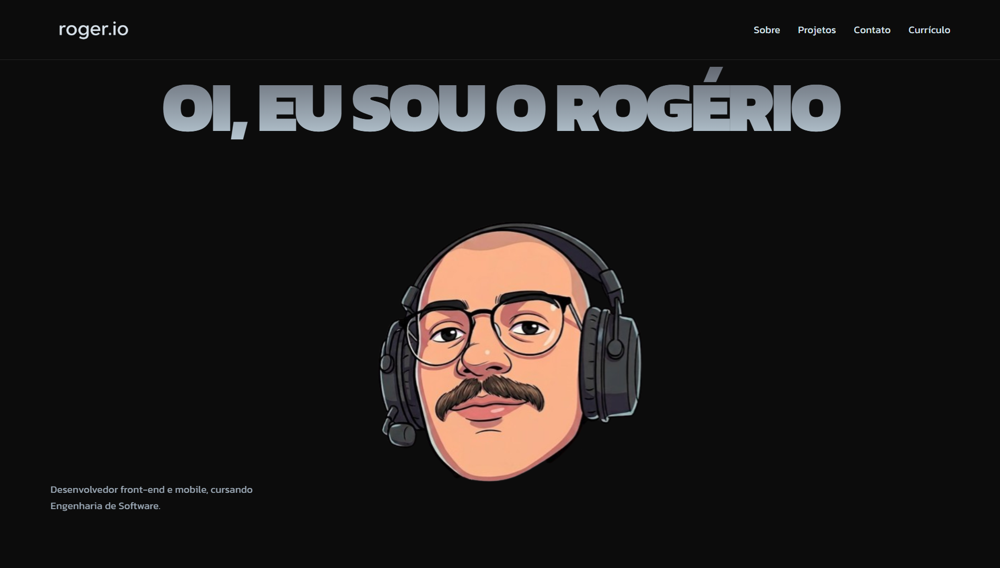 | 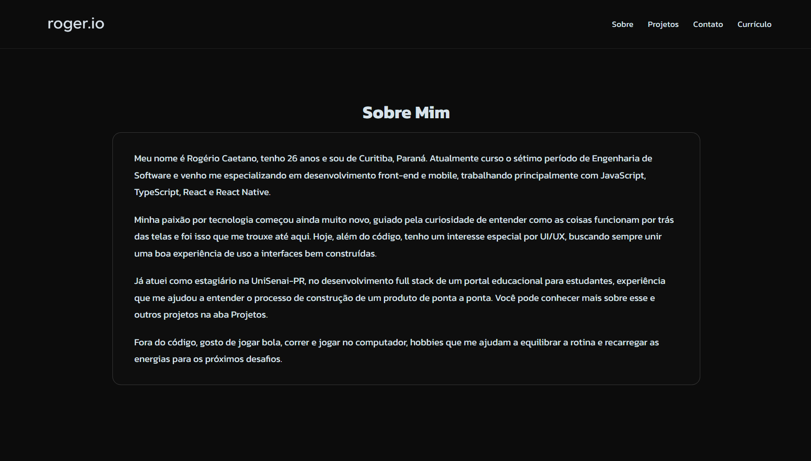 |

| Projetos | Detalhes do Projeto |
| :---: | :---: |
| 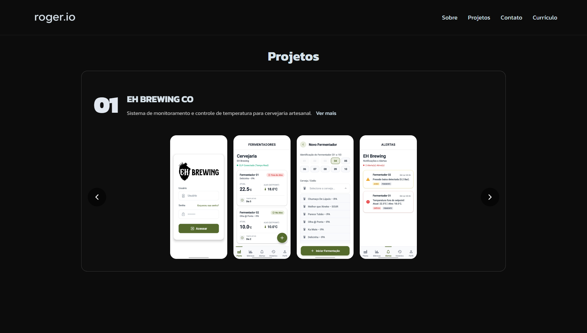 | 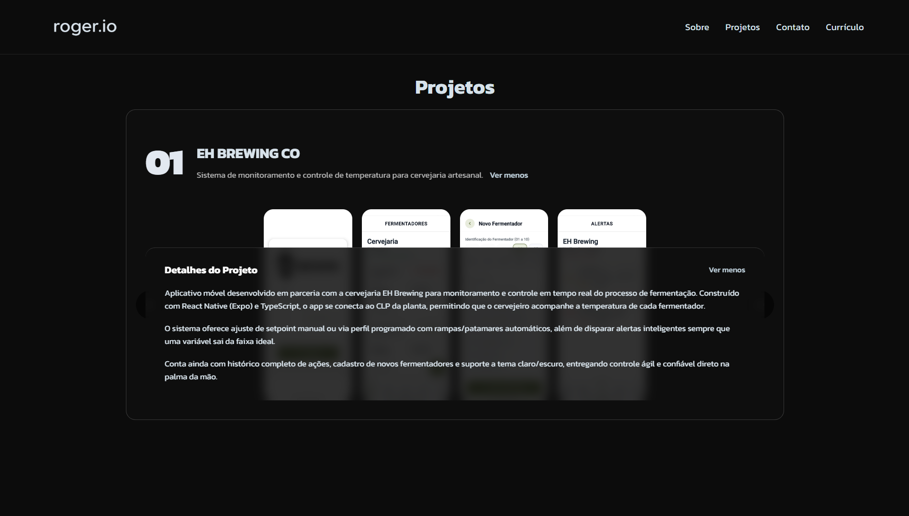 |

| Contato | |
| :---: | :---: |
| 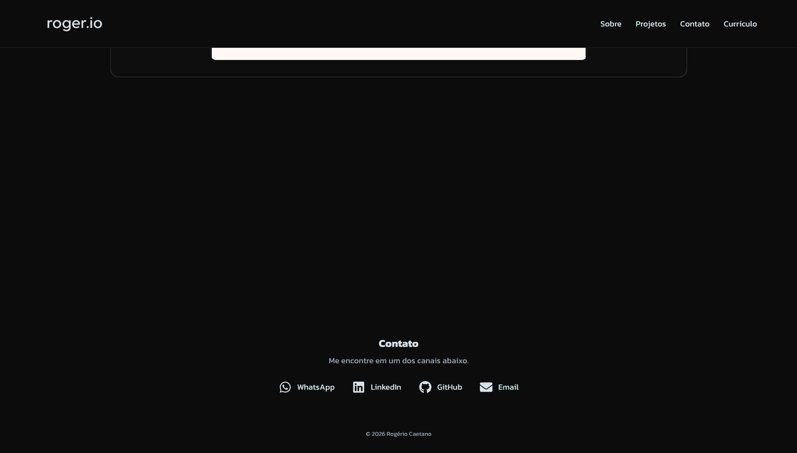 | |

### Mobile

| Hero | Sobre Mim | Projetos |
| :---: | :---: | :---: |
| 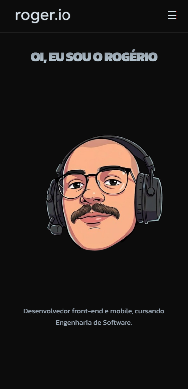 | 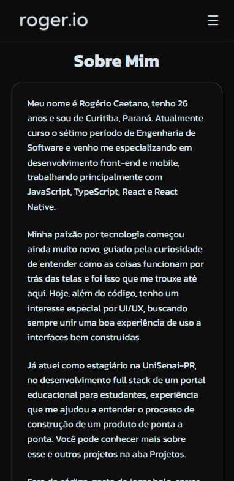 | 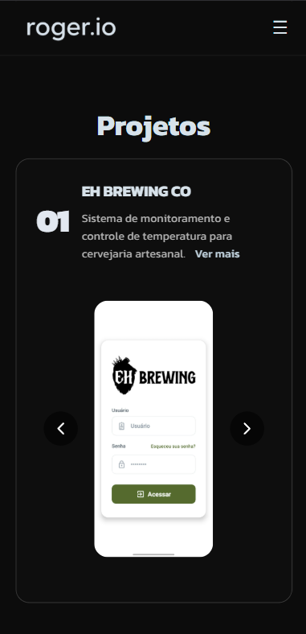 |

| Detalhes do Projeto | Contato | Navegação |
| :---: | :---: | :---: |
| 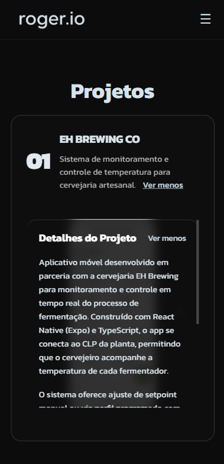 | 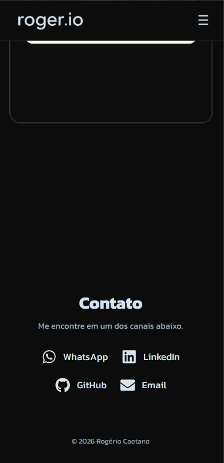 | 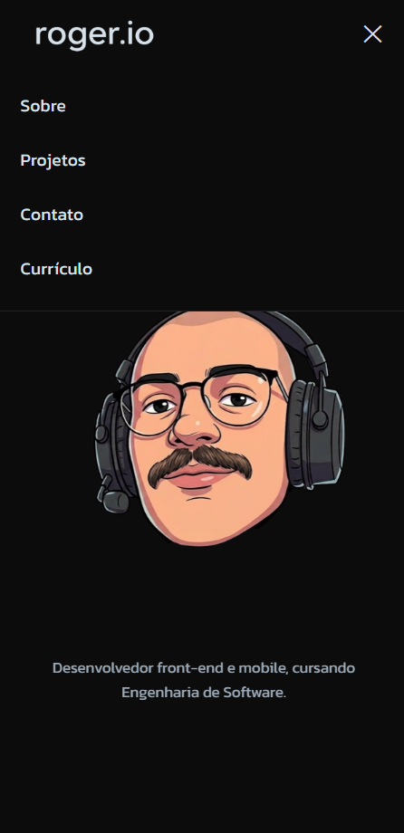 |

## Sobre o projeto

Este projeto tem como objetivo centralizar e expor minha trajetória profissional, bem como os projetos que desenvolvi ao longo da minha carreira e estudos em Engenharia de Software. Construído com foco em alta performance, acessibilidade e um design system limpo (Dark Mode nativo), o portfólio oferece uma experiência de navegação suave e intuitiva tanto em dispositivos móveis quanto em computadores.

## Funcionalidades

O portfólio é composto por seções interativas modulares:
- **Header:** Navegação âncora fixa e responsiva.
- **Hero:** Apresentação inicial marcante com animação de flutuação e tipografia dinâmica.
- **About:** Seção "Sobre Mim" com resumo profissional e interesses.
- **Projects:** Listagem interativa de projetos com carrossel dinâmico. Possui variações otimizadas para apresentação de aplicativos móveis (`ProjectCardMobile`) e sistemas web (`ProjectCardWeb`).
- **Project Details (Bottom Sheet):** Painel deslizante com animações suaves para exibir descrições completas dos projetos sem sair da tela principal.
- **Contact:** Links diretos para redes sociais (LinkedIn, GitHub) e e-mail.
- **Footer:** Rodapé da página.

## Tecnologias utilizadas

O projeto foi desenvolvido com as seguintes tecnologias e bibliotecas:
- [React](https://reactjs.org/) (v18)
- [Vite](https://vitejs.dev/) (Bundler extremamente rápido)
- [Framer Motion](https://www.framer.com/motion/) (Animações e transições fluidas)
- [React Icons](https://react-icons.github.io/react-icons/) (Ícones vetorizados)
- CSS Puro (Estilização direta e flexível)
- ESLint (Padronização e linting de código)

## Como rodar localmente

Siga os passos abaixo para executar o projeto em sua máquina:

1. **Clone o repositório:**
   ```bash
   git clone https://github.com/rogeriocaetanojr/portfolio-rogerio.git
   ```

2. **Acesse o diretório do projeto:**
   ```bash
   cd portfolio-rogerio
   ```

3. **Instale as dependências:**
   ```bash
   npm install
   ```

4. **Inicie o servidor de desenvolvimento:**
   ```bash
   npm run dev
   ```

O aplicativo estará disponível em `http://localhost:5173`. Para gerar o build de produção, utilize `npm run build` e visualize com `npm run preview`.

## Estrutura do projeto

```text
portfolio-rogerio/
├── .github/
│   └── workflows/
│       └── deploy.yml
├── docs/
│   └── screenshots/       # Imagens de preview do projeto
├── public/                # Arquivos públicos e favicon
├── src/
│   ├── assets/            # Imagens de projetos e caricatura
│   ├── components/        # Componentes React
│   ├── App.jsx            # Componente raiz
│   ├── index.css          # Estilos globais e responsividade
│   └── main.jsx           # Ponto de entrada do React
├── index.html
├── package.json
└── vite.config.js
```

## Deploy

O deploy deste projeto é totalmente automatizado através do **GitHub Actions**. Qualquer push ou merge realizado na branch `main` engatilha o workflow definido em `.github/workflows/deploy.yml`, que realiza o build da aplicação utilizando Vite e a publica de forma transparente no **GitHub Pages**.

## Autor

**Rogério Caetano**
